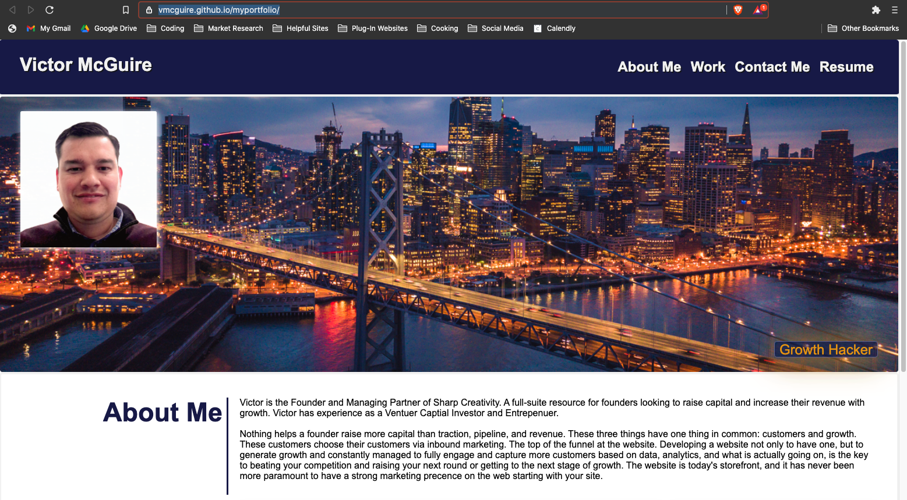
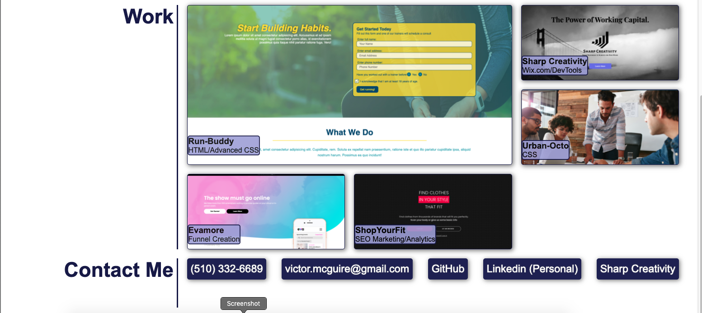

# My Portfolio: Victor McGuire (myportfolio)

## A Display of My Work as a Full-Stack Developer

The purpose of this project was to display the various skill sets and work I have completed as a full stack developer.

I wanted to show this not only by providing access to the work I have completed but also make it an example of the HTML and styling I have learned in this bootcamp!

I tried to put everything I could into this from the last two weeks of class. I hope to be able to use this as a framework for future work.

I learned so much through this process most especially how to use Grid and Flex and to really dominate positioning and sizing of boxes; since that is really what websites are at their core.

https://vmcguire.github.io/myportfolio/

## Installation

1. You can access the developer files here: https://vmcguire.github.io/myportfolio/
2. Download to your machine. 
3. Access just like any other html file with terminal or command console and use your favorite editor to make any updates.
4. Be sure to have the other files in the assets folder downloaded also to ensure their links exist.

## Usage 

The opening photo, headshot, and about me section you will see first as below:

The links at the top right help navitage to the section, quickly, that you would like to go to. 
We wanted to make this easy on the eyes, and cool to interact with. We really like different colors.
In addition, alt text was added to read to visually impared folks as they visit the page.

This is the second portion of the website.

## Credits

Collaborators included the berkeley coding bootcamp team. The original files were pulled from here:
https://ucb.bootcampcontent.com/UCB-Coding-Bootcamp/ucb-virt-bo-fsf-pt-11-2020-u-b/tree/master/02-Advanced-CSS/02-Challenge

## License

*** Copyright (c) 2020 Victor McGuire ***

Permission is hereby granted, free of charge, to any person obtaining a copy
of this software and associated documentation files (the "Software"), to deal
in the Software without restriction, including without limitation the rights
to use, copy, modify, merge, publish, distribute, sublicense, and/or sell
copies of the Software, and to permit persons to whom the Software is
furnished to do so, subject to the following conditions:

The above copyright notice and this permission notice shall be included in all
copies or substantial portions of the Software.

THE SOFTWARE IS PROVIDED "AS IS", WITHOUT WARRANTY OF ANY KIND, EXPRESS OR
IMPLIED, INCLUDING BUT NOT LIMITED TO THE WARRANTIES OF MERCHANTABILITY,
FITNESS FOR A PARTICULAR PURPOSE AND NONINFRINGEMENT. IN NO EVENT SHALL THE
AUTHORS OR COPYRIGHT HOLDERS BE LIABLE FOR ANY CLAIM, DAMAGES OR OTHER
LIABILITY, WHETHER IN AN ACTION OF CONTRACT, TORT OR OTHERWISE, ARISING FROM,
OUT OF OR IN CONNECTION WITH THE SOFTWARE OR THE USE OR OTHER DEALINGS IN THE
SOFTWARE.

---

© 2020 Victor McGuire, Confidential and Proprietary. All Rights Reserved.